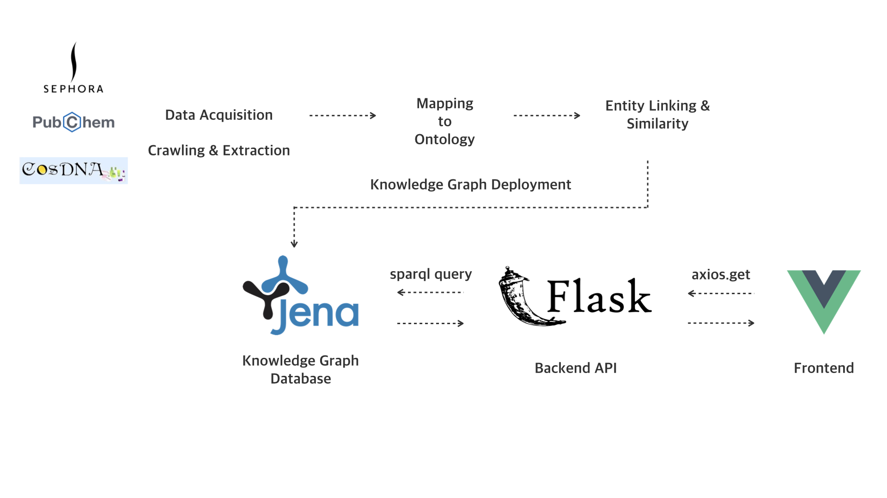

# Knowledge Graph for Cosmetics
Course project for **INF 558 Building Knowledge Graphs** in USC
#### Contributors: 
* Wei-Fan Chen (weifanch@usc.edu)
* Hsin-Yu Chang (hsinyuch@usc.edu)

## Introduction

* To help users to pick the right products without grasping information from different sources and to select suitable items based on users’ needs.

* [final report summary](./papers/report_summary.pdf)
* [demo video](https://youtu.be/sPx3qjVbmaU)


## Data Source
* [Sephora](https://www.sephora.com/)
* [Cosdna](https://www.cosdna.com/)
* [Pubchem](https://pubchem.ncbi.nlm.nih.gov/)

## Pipeline



## How to run
### Set up 


### Run
* Run Apache Jena Fuseki with ttl file
```
   ./fuseki-server --file=RDF_full.ttl /ds
```
* Run Flask server
```
   python ./project/myflask/flaskapp.py
```

## Reference 
- [THESE ARE THE SKINCARE INGREDIENTS YOU SHOULD NEVER MIX](https://www.beautybay.com/edited/skincare-ingredients-you-should-never-mix/)

- [FDA-Allergens in Cosmetics](https://www.fda.gov/cosmetics/cosmetic-ingredients/allergens-cosmetics)
